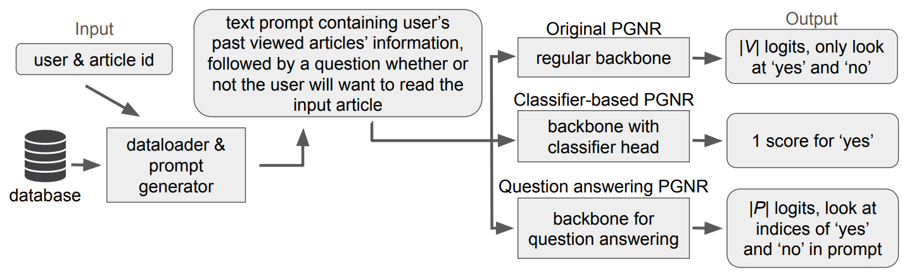
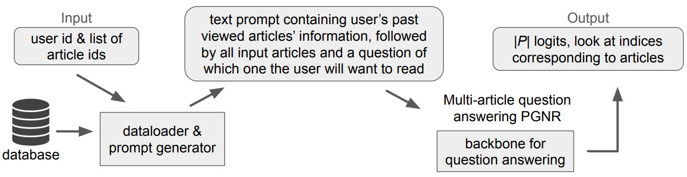
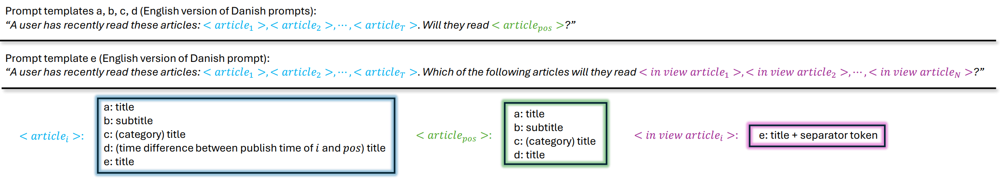

# Generative News Recommendation with mT5

## About

Inspired by [PBNR: Prompt-based News Recommender System](https://arxiv.org/abs/2304.07862) we cast news recommendation as a text-to-text generation problem. We use click logs from a Danish news site provided in the [RecSys Challenge 2024](https://www.recsyschallenge.com/2024/). We summarized our work on a [poster](assets/poster.pdf)

<table align="center">
  <tr align="center">
      <td></td>
      <td></td>
  </tr>
</table>
<table align="center">
  <tr align="center">
      <td></td>
  </tr>
</table>

## Getting started

### Clone code to your device

```bash
git clone https://github.com/WouterBant/RecSys.git
```

```bash
cd RecSys
```

### Environment

For managing dependencies we use Conda, see https://docs.anaconda.com/miniconda/ for installation instructions. When installed take the following steps:

```bash
conda env create -f environment.yml
```

```bash
conda activate RecSys
```

## Evaluation

In the file [evaluate.sh](evaluate.sh) all commands necessary for obtaining the results (except for the random and heurisitic baselines). This includes downloading the fine-tuned mT5 checkpoints from our [huggingface](https://huggingface.co/Wouter01/mT5Ranking) page. We recommend not uncommenting the whole file as the CG checkpoints are 1.2GB and the CGc, QA, and QA+ 689MB. The models are deterministic in evaluation mode so the results will be the same as presented in the [results](results) folder. 

After uncommenting the desired lines run:
```bash
./evaluate.sh
```

## Training

Note that the relevant data will be downloaded automatically without asking for permission when running the following commands. Also, our code uses GPUs when available by default but also works on CPUs.

We ran many experiments, see [main.sh](main.sh) for all commands we used. Uncomment the ones you want to reproduce. Subsequently run:

```bash
./train.sh
```

Note that we have Weights and Biases integration which can be used by adding the ```--use_wandb```  flag to the commands in [main.sh](main.sh). When using W&B make sure you set your api key (https://wandb.ai/authorize) as environment variable:

```bash
export WANDB_API_KEY='your_api_key'
```

## Notebooks

In the [notebooks](notebooks) directory we provide notebooks for data preparation, visualizations, and small experiments.

## Running your own experiments

First change directory to the folder containing all the code:

```bash
cd code
```

We provide many options for running the code:

```
usage: train.py [-h] [--backbone BACKBONE] [--tokenizer TOKENIZER]
                [--from_checkpoint FROM_CHECKPOINT] [--lr LR] [--labda LABDA]
                [--datafraction DATAFRACTION] [--T T] [--n_epochs N_EPOCHS]
                [--batch_size BATCH_SIZE] [--num_workers NUM_WORKERS]
                [--current_step CURRENT_STEP] [--warmup_steps WARMUP_STEPS]
                [--old] [--debug] [--evaltrain] [--use_wandb]
                [--dataset DATASET] [--model {QA,QA+,CG,CGc}]
                [--prompt {titles,subtitles,QA+,diversity,pubtime}]

options:
  -h, --help                            show this help message and exit
  --backbone BACKBONE                   backbone model
  --tokenizer TOKENIZER                 tokenizer model
  --from_checkpoint FROM_CHECKPOINT     load model from checkpoint
  --lr LR                               learning rate
  --labda LABDA                         lambda for pairwise ranking loss
  --datafraction DATAFRACTION           fraction of data to use
  --T T                                 number of previous clicked articles to include in the prompt
  --n_epochs N_EPOCHS                   number of epochs
  --batch_size BATCH_SIZE               batch size
  --num_workers NUM_WORKERS             number of workers
  --current_step CURRENT_STEP           starting step for cosine learning rate
  --warmup_steps WARMUP_STEPS           number of warmup steps
  --old                                 old way of loading from pretrained model
  --debug                               debug mode
  --evaltrain                           for evaluating on training set
  --use_wandb                           Use Weights and Biases for logging
  --dataset DATASET                     dataset to train on
  --model {QA,QA+,CG,CGc}               model to train
  --prompt {titles,subtitles,QA+,diversity,pubtime}
```

For overfitting on a small dataset, you can use:

```bash
python train.py --debug --T 4 --lr 0.001 --batch_size 16 --labda 0.0 --n_epochs 10000 --dataset demo --datafraction 0.001 --n_epochs 10000 --warmup_steps 500 --model [QA/QA+/CG/CGc] --prompt [titles/subtitles/QA+/diversity/pubtime]
```

## Acknowledgement 
The approach largely follows the paper [PBNR: Prompt-based News Recommender System](https://arxiv.org/abs/2304.07862). However, we chose to write the code from scratch as we found this easier as opposed to getting the provided code to work. Thus our implementation differs from this paper but the idea is the same.